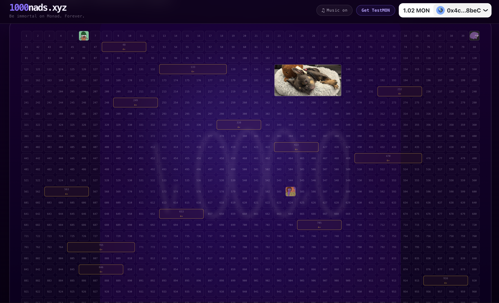
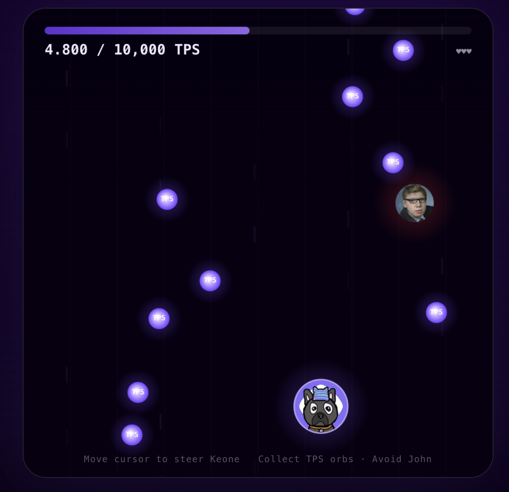

# 1000nads — Be Immortal on Monad. Forever.



> *One wallet. One slot. One permanent place on the page.*

**[1000nads.xyz](https://1000nads.xyz)** is a finite, fully on-chain permanent wall built on the Monad blockchain. Exactly 1,000 slots exist. Each slot can only ever be claimed by one wallet. Once written, it cannot be overwritten. This is not a PFP project. It is not a game. It is a monument — a 40×25 grid of human presence, permanently etched into Monad's history.

---

## The Idea

The internet's most famous pixel grid — the Million Dollar Homepage — sold 1,000,000 pixels in 2005 and became a time capsule of an era. It still exists. The page still loads. The links are mostly dead, but the pixels remain. That page proved something: **permanence on the web is possible, but fragile.**

1000nads makes it unbreakable.

Instead of a server that can go offline, a company that can shut down, or a domain that can expire — 1000nads stores everything on-chain. Your image, your note, your wallet address. The Monad blockchain is the server. The smart contract is the lease — and it never expires.

The Nads are Monad's community. The earliest, the loudest, the most committed believers in what Monad is building. 1000nads is built for them: a permanent record of who was here, who believed, and who left their mark before the rest of the world showed up.

---

## The Wall



The wall is a **40 × 25 grid — 1,000 slots**. Each slot is a permanent pixel on the Monad timeline.

To keep it honest, entry is gated. Before you can claim a slot, you have to play **KeoneSprint** — a canvas mini-game where you steer Keone (Monad's CEO) through a field of TPS orbs while dodging John. Collect enough orbs to push Monad past 10,000 TPS and the wall opens for you. It's a 30-second proof of attention, not of capital.

Once inside, you pick your slot, upload an image, write a note, optionally link your X/Twitter handle — and mint. One transaction. Your image gets resized to 160×160px, base64-encoded, and written directly to the contract. No IPFS. No external CDN. No dependencies. Just Monad.

**The wall is read-only for everyone except the claimer. Once minted, the slot is sealed.**

---

## Slot Tiers

Not all slots are equal. The grid contains special **mega blocks** — wider slots for those who want more presence.

| Tier | Size | Price |
|------|------|-------|
| Standard | 1 × 1 | 1 MON |
| Premium 4-wide | 4 × 1 | 40 MON |
| Premium 6-wide | 6 × 1 | 60 MON |

There are **3 six-wide** and **10 four-wide** premium blocks distributed across the grid. The special slot `#143` is reserved — it holds **Anago**, Keone's dog, immortalized as the wall's permanent mascot.

---

## Smart Contract

**Deployed on Monad Testnet**
`0xF717dC0D19f8825e14C8AAa2a96dCF1d30F3710f`

The contract is minimal and auditable. No upgradeable proxies. No admin backdoors beyond the two maintenance functions (`adminClearSlot`, `setPremiumPrice`). The core logic fits in one file.

```solidity
contract SpotWall {
    uint256 public constant TOTAL_SLOTS   = 1000;
    uint256 public constant DEFAULT_PRICE = 1 ether;  // 1 MON

    struct Spot {
        address owner;
        string  imageUri;   // base64-encoded, stored fully on-chain
        string  note;       // @twitter|note, max 96 chars
        bool    isPermanent;
        uint256 mintedAt;
    }

    mapping(uint256 => Spot)    public spotData;
    mapping(address => uint256) public walletToSlot;  // one wallet = one slot
    mapping(uint256 => uint256) public premiumPrice;
}
```

### Key invariants enforced on-chain

- **One wallet, one slot** — `walletToSlot[msg.sender]` blocks double-minting at the contract level, not just in UI
- **One slot, one owner** — `spotData[slotId].owner == address(0)` is checked before every mint
- **Image size** — max 180,000 bytes on-chain; the frontend enforces 160×160px resize before submission
- **Note safety** — quotes, backslashes, and control characters are rejected to prevent JSON injection in `tokenURI`
- **Correct payment** — `msg.value == slotPrice(slotId)` enforced exactly; no over/underpayment

### Functions

| Function | Description |
|----------|-------------|
| `mintSpot(slotId, imageUri, note, isPermanent)` | Claim a slot. Payable. |
| `spotData(slotId)` | Returns full slot data (owner, image, note, timestamp) |
| `ownerOfSlot(slotId)` | Returns the owner address of a slot |
| `tokenURI(slotId)` | Returns a fully on-chain base64-encoded JSON metadata URI |
| `slotPrice(slotId)` | Returns the price for a given slot (default or premium) |
| `setPremiumPrice(slotId, price)` | Admin: set premium pricing |
| `adminClearSlot(slotId)` | Admin: clear a slot (maintenance only) |
| `withdraw(to)` | Admin: withdraw collected MON |

---

## Architecture

```
1000nads.xyz
├── app/
│   ├── api/slots/route.ts     # Server-side RPC proxy + cache layer
│   ├── layout.tsx             # Root layout, metadata
│   ├── page.tsx               # Entry point — renders WallBoard
│   └── providers.tsx          # Wagmi + RainbowKit providers
├── components/
│   ├── WallBoard.tsx          # Main state machine: gate → wall → form → done
│   ├── KeoneSprint.tsx        # Canvas mini-game gate
│   └── AmbientAudio.tsx       # Background sound
├── contracts/
│   └── SpotWall.sol           # Solidity contract (Foundry)
├── lib/
│   ├── contracts.ts           # ABI, addresses, mega block definitions
│   ├── wagmi.ts               # Chain config with Multicall3 address
│   └── mock-slots.ts          # Empty slot factory
└── script/
    └── DeploySpotWall.s.sol   # Foundry deploy script
```

### The Slot Data Pipeline

The Monad testnet RPC enforces a strict rate limit. Naively querying 1,000 slots individually would fail. The pipeline handles this in layers:

```
Browser  ──fetch──▶  /api/slots  ──multicall──▶  Monad RPC
                         │
                    [in-memory cache, 30s TTL]
                    [stale-while-revalidate]
                    [concurrency limiter: max 5 multicall / max 8 individual]
                    [merge with previous cache on partial failure]
```

1. **Pass 1 — Owner scan**: Multicall3 batches `ownerOfSlot` for all 1,000 slots in groups of 100 (10 requests total). Max 5 run concurrently.
2. **Individual fallback**: Any slot whose multicall item returned `failure` status is retried individually. Max 8 concurrent, with exponential backoff.
3. **Pass 2 — Spot data**: `spotData()` is called only for confirmed-minted slots. Max 5 concurrent.
4. **Cache merge**: If an owner lookup fails for a slot that was previously minted (known from the prior cache cycle), the old data is preserved rather than silently dropped. A `null` API response never clears a slot from the wall.

On the frontend, `useSlots` maintains a `slotsRef` that merges — never replaces — each API response into the current display state. A slot that is visible will stay visible unless the contract explicitly confirms it is empty.

---

## Tech Stack

| Layer | Technology |
|-------|-----------|
| Frontend framework | Next.js 14 (App Router) |
| Wallet / Web3 | Wagmi v2 + RainbowKit |
| RPC client | Viem |
| Smart contract | Solidity 0.8.24, Foundry |
| Styling | Plain CSS (no Tailwind) |
| Server | Hostinger VPS, PM2, Nginx |
| SSL | Let's Encrypt (auto-renew) |
| Chain | Monad Testnet (chain ID: 10143) |

---

## Local Development

### Prerequisites

- Node.js 18+
- Foundry (`curl -L https://foundry.paradigm.xyz | bash`)

### Setup

```bash
git clone https://github.com/gizdusum/1000nads.git
cd 1000nads
npm install
cp .env.example .env.local
# Fill in NEXT_PUBLIC_CONTRACT_ADDRESS and NEXT_PUBLIC_WALLETCONNECT_PROJECT_ID
npm run dev
```

The app runs on `http://localhost:3000`. Setting `NEXT_PUBLIC_CONTRACT_ADDRESS` to the zero address (`0x000...000`) enables mock/disabled mode — the wall renders with no chain calls.

### Contract Deployment

```bash
# Set your deployer key and RPC in .env.local
forge script script/DeploySpotWall.s.sol:DeploySpotWall \
  --rpc-url $MONAD_RPC_URL \
  --broadcast
```

---

## Environment Variables

| Variable | Description |
|----------|-------------|
| `NEXT_PUBLIC_CONTRACT_ADDRESS` | Deployed SpotWall address |
| `NEXT_PUBLIC_WALLETCONNECT_PROJECT_ID` | WalletConnect project ID |
| `MONAD_RPC_URL` | Monad RPC for Foundry scripts |

Set `NEXT_PUBLIC_CONTRACT_ADDRESS` to `0x0000000000000000000000000000000000000000` to run in mock mode (no chain, no wallet needed).

---

## The Vision

Monad is not just a faster EVM. It is a rethinking of what a blockchain can be — parallel execution, pipelined consensus, 10,000+ TPS with full EVM compatibility. When Monad launches on mainnet, it will attract a wave of new users, new builders, and new capital. The people who were here before that wave — the Nads — will have a permanent record of their presence.

1000nads is that record.

The wall has 1,000 slots. Monad mainnet will have millions of users. By the time most people arrive, the wall will be full. The early Nads who claimed their square will have something no amount of money can buy after the fact: **proof that they were here first.**

Every slot is a timestamp. Every image is an identity. Every note is a message to whoever reads the wall in 2030, or 2040, or whenever. The blockchain doesn't care. It just holds the data — forever.

---

## Credits

- **Keone** — Monad CEO. Steering him through TPS orbs is the only entry requirement.
- **Anago** — Keone's dog. Slot #143. Reserved forever.
- **John** — The obstacle. Avoid him.
- **The Nads** — Everyone who claimed a square before the world showed up.

---

*Built with [Build Anything](https://x.com/buildanythingso) education · Deployed on Monad Testnet*

*[@gizdusumandnode](https://x.com/gizdusumandnode) · [github.com/gizdusum](https://github.com/gizdusum)*
